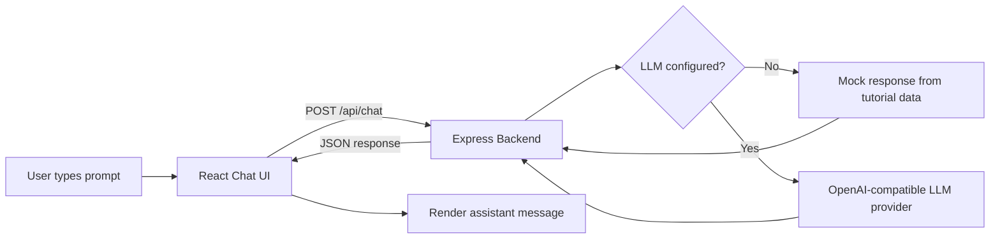
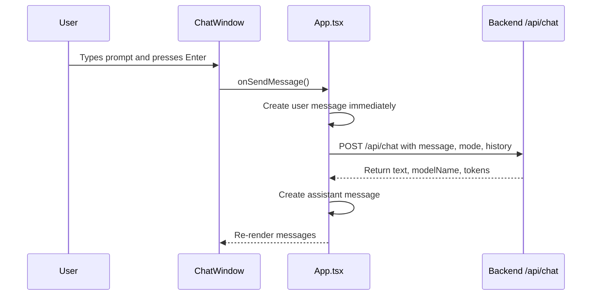
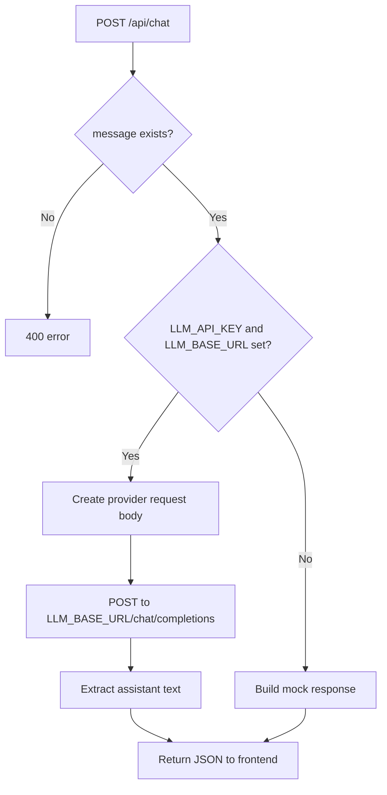
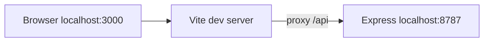

# How The AI UI/UX Lab Works

This project is a small teaching app for AI chat UI/UX. It has two main parts:

- **Frontend:** React + Vite app running at `http://localhost:3000`
- **Backend:** Express API running at `http://localhost:8787`

The frontend never talks directly to an LLM provider. It sends prompts to your own backend at `/api/chat`. The backend decides whether to use a real provider or the built-in mock response.

## High-Level Diagram



Same idea as ASCII:

```text
[User]
  |
  v
[React /chat screen]
  |
  | POST /api/chat
  v
[Express backend]
  |
  +-- if LLM_BASE_URL + LLM_API_KEY exist --> [LLM provider]
  |
  +-- otherwise ---------------------------> [mock backend response]
  |
  v
[JSON response]
  |
  v
[React renders assistant bubble]
```

## Why The Backend Exists

The backend protects the app from three common problems:

1. **Secret leakage**
   The browser is public. Anything shipped to React can be inspected by users. Provider keys must stay on the server.

2. **Provider flexibility**
   The UI should not care whether the model is OpenAI, Ollama, OpenRouter, Azure OpenAI, or another OpenAI-compatible API.

3. **Control point**
   The backend is where you later add auth, rate limiting, logging, prompt templates, moderation, RAG, and billing rules.

## Frontend Prompt Flow

The main flow starts in `src/App.tsx`.



The frontend sends this shape:

```json
{
  "message": "Explain tokens like I am a beginner.",
  "mode": "Beginner",
  "history": [
    {
      "role": "user",
      "content": "Previous prompt"
    },
    {
      "role": "assistant",
      "content": "Previous answer"
    }
  ]
}
```

Important frontend details:

- The user message is added before the backend responds, so the UI feels instant.
- `isLoading` turns on while the backend is processing.
- The last few messages are sent as `history` so the backend can pass conversational context to a real model.
- If `/api/chat` fails, the UI shows a local fallback message. This keeps the tutorial demo from breaking.

## Backend Processing Flow

The backend lives in `server.ts`.



The backend returns this shape:

```json
{
  "text": "Assistant response text...",
  "modelName": "mock-backend",
  "tokens": 194,
  "source": "mock"
}
```

When a provider is configured, `source` becomes `provider`.

## Provider-Neutral Configuration

The backend expects OpenAI-compatible chat completions.

```env
LLM_BASE_URL="https://api.openai.com/v1"
LLM_API_KEY="your-secret-key"
LLM_MODEL="gpt-4o-mini"
LLM_TEMPERATURE="0.3"
PORT="8787"
```

Examples:

```env
# OpenAI
LLM_BASE_URL="https://api.openai.com/v1"
LLM_MODEL="gpt-4o-mini"
```

```env
# Ollama local, if OpenAI-compatible API is enabled
LLM_BASE_URL="http://localhost:11434/v1"
LLM_API_KEY="local-placeholder"
LLM_MODEL="llama3.2"
```

```env
# OpenRouter
LLM_BASE_URL="https://openrouter.ai/api/v1"
LLM_MODEL="mistralai/mistral-small"
```

## Development Ports

During development:

```text
React app:     http://localhost:3000
Express API:   http://localhost:8787
Frontend URL:  http://localhost:3000/chat
API route:     http://localhost:3000/api/chat
```

Vite proxies `/api/*` from port `3000` to port `8787`.



## Production Shape

In production, Express can serve the built React app and the API from one origin:

```text
https://your-app.com/chat
https://your-app.com/api/chat
```

That avoids browser CORS issues and keeps deployment simple.

## Teaching Notes For The Video

Use this order when explaining:

1. Start with the UI state: input, messages, loading.
2. Explain why the frontend should not hold provider keys.
3. Show the `/api/chat` request payload.
4. Show the backend validation step.
5. Explain the provider switch: mock mode vs real provider mode.
6. Return JSON to the frontend.
7. Render the assistant message.

The key lesson:

```text
UI should collect intent.
Backend should protect secrets and process the prompt.
Provider should generate the answer.
UI should render the result clearly.
```

## Next Backend Upgrades

Good next additions:

- Auth middleware
- Per-user rate limits
- Request logging
- Streaming responses
- Prompt templates
- RAG document retrieval
- Tool calling
- Chat session persistence
